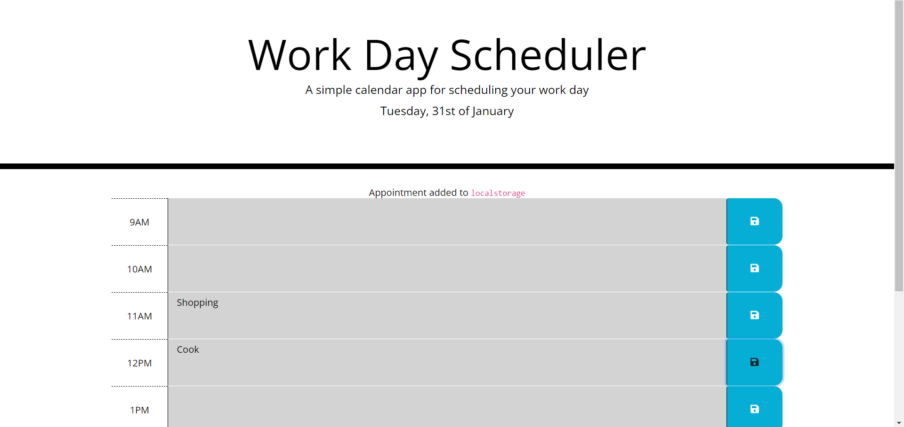

# Calendar Planner Application

# Building a Calendar Planner Using JavaScript

## Description:

I built this project to create a functional calendar that can be used to plan to-do lists or appointments using the skills I have learnt in JS.

With the help of utilizing the local storage, whenever the user comes back to the application, their appointments or to-do lists/items will still be visible; making it easier to not forget important tasks 

## Deployed Link:

https://adammbnitro.github.io/Calendar-Planner-App/

## License 

Copyright (c). All rights reserved.

Licensed under the MIT license.
